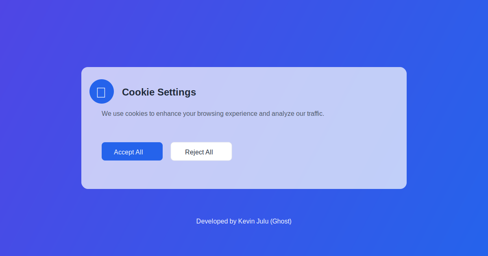

# Modern Cookie Consent Banner

A beautiful, responsive cookie consent banner with glassmorphism design and detailed cookie preference management.



## Features

- 🎨 Modern Glassmorphism Design
- 📱 Fully Responsive
- ✨ Smooth Animations
- 🔧 Detailed Cookie Preferences
- 💾 Persistent Settings (localStorage)
- 🎯 Easy to Integrate
- 🌐 Cross-browser Compatible

## Cookie Categories

- Essential Cookies (Always enabled)
- Analytics Cookies
- Marketing Cookies
- Personalization Cookies

## Usage

1. Include the CSS and JS files in your project:
```html
<link rel="stylesheet" href="css/cookie-banner.css">
<script src="js/cookie-banner.js"></script>
```

2. Add the banner HTML to your page:
```html
<!-- Copy the cookie banner HTML from index.html -->
<div class="cookie-banner">
    <!-- ... -->
</div>
```

## Customization

You can customize the appearance by modifying the CSS variables in `cookie-banner.css`:

```css
:root {
    --primary-color: #2563eb;
    --text-color: #1f2937;
    --background: rgba(255, 255, 255, 0.7);
}
```

## Browser Support

- Chrome (latest)
- Firefox (latest)
- Safari (latest)
- Edge (latest)
- Opera (latest)

## Developer

Created with 💻 by Kevin Julu (Ghost)

- GitHub: [Kevin Julu](https://github.com/kevinjulu)
- Portfolio: [ghost.dev](#) <!-- Add your portfolio URL -->

## License

MIT License - feel free to use in your projects

## Contributing

1. Fork the repository
2. Create your feature branch (`git checkout -b feature/AmazingFeature`)
3. Commit your changes (`git commit -m 'Add some AmazingFeature'`)
4. Push to the branch (`git push origin feature/AmazingFeature`)
5. Open a Pull Request

---

<p align="center">Made with ❤️ by Ghost</p>
